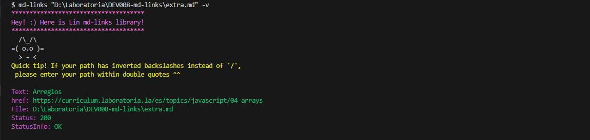

# Markdown Links

## Tabla de Contenidos
1. [Proyecto](#proyecto)
2. [Uso de la librería](#uso-de-la-libreria)
3. [Instalación](#instalacion)
4. [Ejemplos](#ejemplos)

***

## 1. Proyecto

Markdown es un lenguaje de marcado ligero muy popular, se encuentra en muchos lugares, como en GitHub, foros o blogs. Por ejemplo, si ves un archivo llamado README.md en un proyecto, ¡ese es Markdown!Los archivos de Markdown a menudo tienen enlaces, como los que ves en las páginas web. Pero a veces esos enlaces están rotos, lo que significa que no funcionan bien.Imagina que estás en un grupo de personas que escriben código. Te han pedido que hagas una herramienta especial usando Node.js. Esta herramienta leerá esos archivos de Markdown y verificará si los enlaces funcionan. También te dará información interesante sobre esos enlaces. ¡Así podrás mantener todo en orden!

## 2. Uso de la librería

* `md-links file.md`: Revisa el archivo file.md y muestra todos los enlaces que encuentra. También dice en qué parte del archivo están y qué texto tienen.

  Tip: En caso de que el path contenga diagonales invertidas, como en este ejemplo ("D:\carpeta\file\abc.md"), asegúrate de colocar el path entre comillas dobles para que pueda leerlo correctamente.

* `md-links file.md -v`: Con esta opción en la terminal se verificarán los enlaces en el archivo file.md y se mostrarán más detalles. Esto incluye la ruta del archivo, el texto del enlace y si el enlace está bien o tiene algún problema.

* `md-links file.md -s`: Esta opción muestra información básica sobre los enlaces en el archivo file.md. Sabrás cuántos enlaces hay en total, cuántos de ellos son únicos (sin repetirse) y cuántos enlaces rotos hay.

    
## 3. Instalación

Para instalar la librería Md-links escribe en la terminal el siguiente comando:

npm i md-links

Y después en la consola podrás utilizarlo como en este ejemplo: 
    En la consola agrega lo siguiente:

md-links + La ruta relativa o absoluta del archivo, ejemplo: ./nombredeCarperta + Opciones de comandos

## 4. Ejemplos

