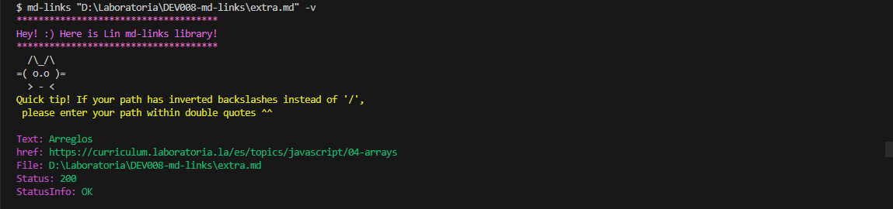
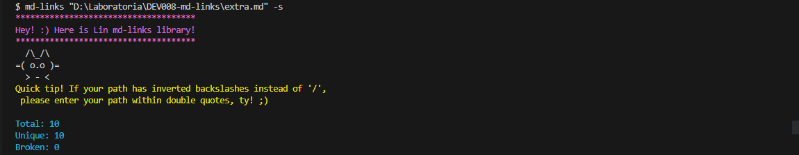
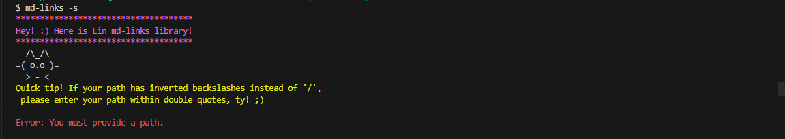

# Markdown Links

## Tabla de Contenidos
1. [Proyecto](#proyecto)
2. [Uso de la librería](#uso-de-la-libreria)
3. [Instalación](#instalacion)
4. [Ejemplos](#ejemplos)

***

## 1. Proyecto

Markdown es un lenguaje de marcado ligero muy popular, se encuentra en muchos lugares, como en GitHub, foros o blogs. Por ejemplo, si ves un archivo llamado README.md en un proyecto, ¡ese es Markdown!Los archivos de Markdown a menudo tienen enlaces, como los que ves en las páginas web. Pero a veces esos enlaces están rotos, lo que significa que no funcionan bien. 

Esta librería impulsada por Node.js, puede detectar enlaces quebrados y brinda estadísticas concisas, de esta forma puedes tomar decisiones informadas sobre la integridad de los enlaces en tus archivos. 

## 2. Uso de la librería

* `lin-md-links file.md`: Revisa el archivo file.md y muestra todos los enlaces que encuentra. También dice en qué parte del archivo están y qué texto tienen.

  Tip: En caso de que el path contenga diagonales invertidas, como en este ejemplo ("D:\carpeta\file\abc.md"), asegúrate de colocar el path entre comillas dobles para que pueda leerlo correctamente.

* `lin-md-links file.md -v`: Con esta opción en la terminal se verificarán los enlaces en el archivo file.md y se mostrarán más detalles. Esto incluye la ruta del archivo, el texto del enlace y si el enlace está bien o tiene algún problema.

* `lin-md-links file.md -s`: Esta opción muestra información básica sobre los enlaces en el archivo file.md. Sabrás cuántos enlaces hay en total, cuántos de ellos son únicos (sin repetirse) y cuántos enlaces rotos hay.

    
## 3. Instalación

Para instalar la librería Md-links escribe en la terminal el siguiente comando:

npm i lin-md-links

Y después en la consola podrás utilizarlo como en este ejemplo: 
    En la consola agrega lo siguiente:

*`lin-md-links + La ruta relativa o absoluta del archivo, ejemplo: ./nombredeCarperta + Opciones de comandos`

## 4. Ejemplos

